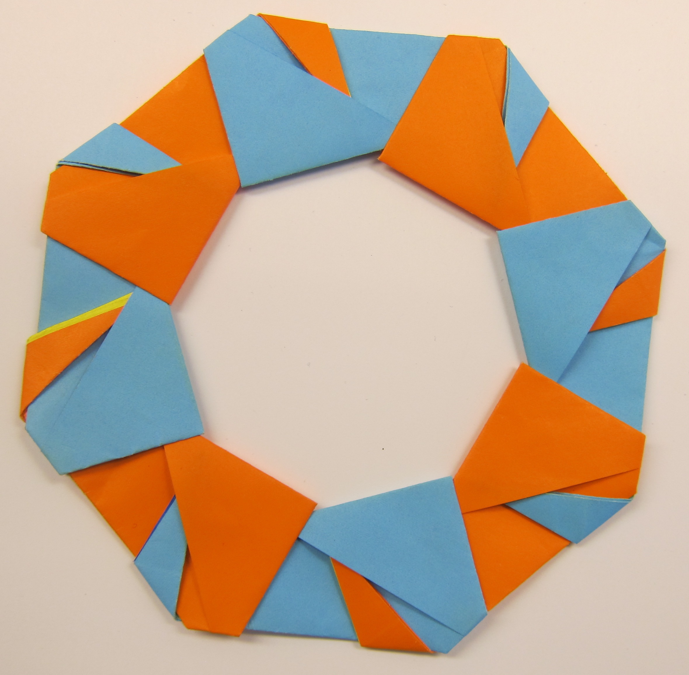

# Setup

Rustr support Linux, Mac, and Windows.



[@ Chris Lott](https://www.flickr.com/photos/fncll/8604144457/in/photolist-xELx44-aeGtnt-xbcPF1-nT2ZFk-o2wrom-xbcZxW-xs1Le9-xELyLn-xsQof6-mL9ndW-59oVCm-2wPrE-ec7aPH-wvX6sc-8pgKJf-9KiRJr-e7juoe-rzsGcV-7oofH7-2wPrn-dVsH5X-hLf6aW-66S3Qg-8G1fuT-2wPrt) [CC 2.0](https://creativecommons.org/licenses/by/2.0/deed.en)

## Windows

### Get R

Get [R > 3.3.0](https://cran.r-project.org/bin/windows/base/R-3.3.0beta-win.exe) builded by GCC 4.9 and [Rtools 3.3](https://cran.r-project.org/bin/windows/Rtools/Rtools33.exe)

### Get Rust with GNU ABI 

Checkout https://www.rust-lang.org/downloads.html

One of stable, beta, or nightly version of Rust is OK. You can put Rust installation in `PATH` or set `CARGO_HOME` environment variable to the path of `cargo.exe`. 

If you want to build multi-arch R package, make sure you install both 64bit and 32bit Rust standard library, for example `C:\Rust\lib\rustlib\i686-pc-windows-gnu` and `C:\Rust\lib\rustlib\x86_64-pc-windows-gnu`

### Get rustinr

Run This in R:

```r
install.packages("devtools")
devtools::install_github("rustr/rustinr")
```

And we are ready to play!

Run this in R console.

```r
library(rustinr)

rust(code ='
// #[rustr_export]
pub fn say_hi() -> String{
	"Hello World".into()
}
')

say_hi()
#> [1] "Hello World"
```

If some errors show up, run `check_rustr` to get more info:

```r
check_rustr(detail = T)
```

## Mac

### Get R

Get [R > 3.3.0](https://cran.r-project.org/bin/macosx/).

### Get Rust with GNU ABI 

Checkout https://www.rust-lang.org/downloads.html

```
curl -sSf https://static.rust-lang.org/rustup.sh | sh
```


One of Stable, Beta, or Nightly version of Rust is OK. 

You can put Rust installation in path or set `CARGO_HOME` environment variable to the path of `cargo`.

### Get rustinr

Run This in R:

```r
install.packages("devtools")
devtools::install_github("rustr/rustinr")
```

### Get Xcode Command Line Tools

Open Terminal, and run `git` or `clang`, It may show a message to get you started. 

Or you can check [this great guide](http://rud.is/b/2015/10/20/installing-r-on-os-x/).

And we are ready to play!

Run this in R console.

```r
library(rustinr)

rust(code ='
// #[rustr_export]
pub fn say_hi() -> String{
	"Hello World".into()
}
')

say_hi()
#> [1] "Hello World"
```

If some errors show up, run `check_rustr` to get more info:

```r
check_rustr(detail = T)
```

## Linux

### Get R

Get [R > 3.3.0](https://cran.r-project.org/).

### Get Rust with GNU ABI 

```bash
curl -sSf https://static.rust-lang.org/rustup.sh | sh
```

One of Stable, Beta, or Nightly version of Rust is OK. 

You can put Rust installation in path or set `CARGO_HOME` environment variable to the path of `cargo`.

### Get rustinr

Run This in R:

```r
install.packages("devtools")
devtools::install_github("rustr/rustinr")
```

And we are ready to play!

Run this in R console.

```{r}
library(rustinr)

rust('
// #[rustr_export]
pub fn say_hi() -> String{
	"Hello World".into()
}
')

say_hi()
```

If some errors show up, run `check_rustr` to get more info:

```r
check_rustr(detail = T)
```

## Playground with Docker

Visit https://play.rustr.org , and begin to code Rust in R.

This Web App is run in a Docker container. If you want to run this app locally. You can install [Docker](https://docs.docker.com/windows/), and then run:

```bash
docker pull qinwf/shiny-rust-docker

docker run -p 3838:3838 qinwf/shiny-rust-docker
```

Visit http://127.0.0.1:3838 for your local version of rustr playground.

You can also run this Docker image with an R console that supports Rust:

```bash
docker run -ti --rm qinwf/shiny-rust-docker R
```
