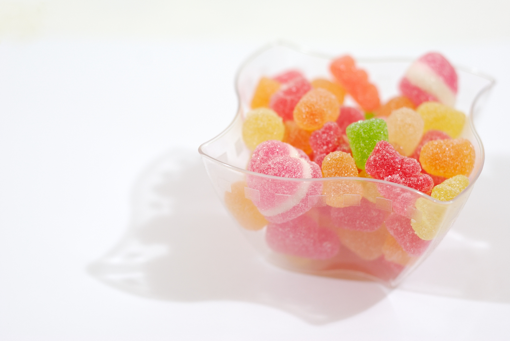

# R Object

More in [Rust Docs](https://docs.rustr.org/rustr/).

[@ Gloria Garcia](https://www.flickr.com/photos/fl4y/5411655538/) [CC BY-NC-ND 2.0](https://creativecommons.org/licenses/by-nc-nd/2.0/)

## Vector

TODO

https://docs.rustr.org/rustr/vector/index.html

### NumVec

https://docs.rustr.org/rustr/vector/numvec/struct.NumVecM.html

### IntVec

https://docs.rustr.org/rustr/vector/intvec/struct.IntVecM.html

### RawVec

https://docs.rustr.org/rustr/vector/rawvec/struct.RawVecM.html

### BoolVec

https://docs.rustr.org/rustr/vector/boolvec/struct.BoolVecM.html

### CplVec

https://docs.rustr.org/rustr/vector/cplvec/struct.CplVecM.html

## VectorX - Special Vector

### CharVec

https://docs.rustr.org/rustr/vectorx/charvec/struct.CharVecM.html

### List

https://docs.rustr.org/rustr/vectorx/list/struct.RListM.html

### ExprVec

https://docs.rustr.org/rustr/vectorx/exprvec/struct.ExprVecM.html

## Rcomplex

https://docs.rustr.org/rustr/rdll/win64/struct.Struct_Unnamed9.html

## Envir - Enviroment 

https://docs.rustr.org/rustr/environment/struct.EnvirM.html

## RFun - Function 

https://docs.rustr.org/rustr/rfunction/struct.RFunM.html

## RPtr - External Pointer 

https://docs.rustr.org/rustr/rptr/struct.RPtrM.html

## Fml - Formula 

https://docs.rustr.org/rustr/formula/struct.RFmlM.html

## RError - Error 

https://docs.rustr.org/rustr/error/struct.RError.html

## Symbol - Symbol 

https://docs.rustr.org/rustr/symbol/struct.SymbolM.html

## Promise - Promise 

https://docs.rustr.org/rustr/promise/struct.PromiseM.html

## S4 - S4 

https://docs.rustr.org/rustr/s4/struct.S4M.html

## Reference - RC 

https://docs.rustr.org/rustr/reference/struct.ReferenceM.html

## RObj - Object 

https://docs.rustr.org/rustr/robject/struct.RObjM.html

## RWeak - Weak Reference 

https://docs.rustr.org/rustr/rweak/struct.RWeakM.html

## RRand - Random Source

https://docs.rustr.org/rustr/feature/random/struct.RRand.html

## RLang - Language 

https://docs.rustr.org/rustr/rlang/struct.RLangM.html
